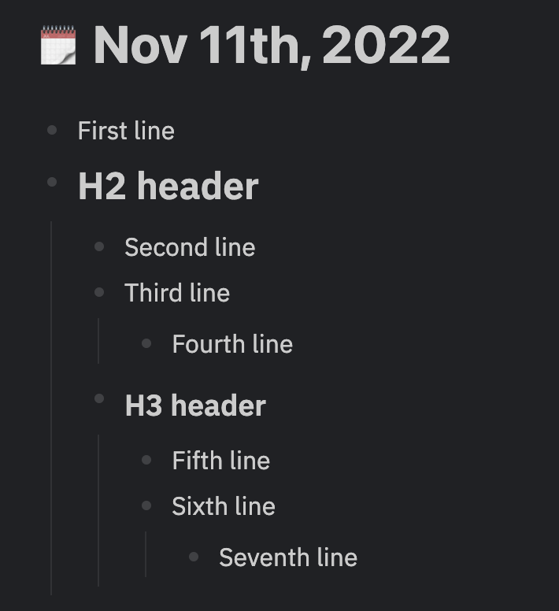
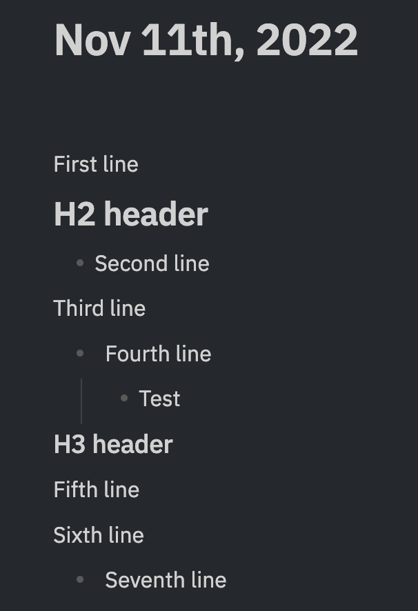

# LogSeqToObsidian

LogSeq and Obsidian: are two (awesome) note taking tools.

I: am a flawed human with a penchant for flitting between note taking apps.

These: are a couple of files to help me migrate from LogSeq to Obsidian.

**Please: backup all of your files before trying the migration script on your own data. The script is highly experimental.**

## `bonofix-snippet.css`

A small CSS snippet to help Obsidian look more like a mix of the (LogSeq Bonofix Theme)[https://github.com/Sansui233/logseq-bonofix-theme] and Typora

Install the Minimal theme, and then paste it in your snippets folder and enable it. Doesn't do much more than (what I consider) the basics - any contributions welcome.

## `convert_notes.py`

A basic Python script that converts LogSeq's markdown files to a style that plays nicer with Obsidian.

Usage: `python convert_notes.py --logseq /path/to/logseq/graph --output /path/to/output/folder`
Add the `--overwrite_output` flag if you want any existing folder at the output path to be overwritten 

Known assumptions:
* Dots in the logseq filename are assumed to indicate namespaces
* `<` and `>` characters are assumed to be part of text, and therefore escaped so that they display correctly in Obsidian

What this script does:
* Creates a folder/subfolder hierarchy based on namespaces, copies notes appropriately, and updates links between notes
* Links to notes that have not yet been created are replaced with tags
* Copies embedded assets into an 'attachments' subfolder under the given note. Resizes embedded images in Obsidian to match any resizing that was done in Logseq
* Removes block links and block embeds
* Converts front matter of the `title:: My Note` format to the format expected by Obsidian (`key: value` wrapped in triple-hyphen lines)
* If a code block has been embedded inside a list, prepends a line - without this, the code block does not display correctly
* Minor reformatting to prettify notes: escapes `<` and `>` characters, replaces 2-4 spaces with a tab, ignores Logseq artefacts like `collapsed:: true`

What this script does not do:
* Process page properties, and use them for finding namespaces
* Get file copier to work with subfolders in logseq (right now only copies pages in the base directory)
* Handle aliases
* Handle namespaces under journal pages
* Embed PDF as option
* Seems like asset names cannot have '%20' in them - is that right?

### I might also like to do the below at some point

(That is, none of the below has been done)

First, a note on content reformatting. LogSeq and Obsidian both allow for headers and outlining, but one key difference is that Obsidian lets you fold headings to collapse the content under it. LogSeq doesn't let you do this, so if you want a header to be foldable, you have to indent one level under it. My script assumes that any indents you've made after a header in LogSeq are just for the purpose of folding, and should be undone. Specifically, this is what will happen:
* All content will be outdented one level (since everything starts off as part of an outline in LogSeq)
* Then, anything under a H2 header will be outdented another level.
* Then, anything under a H3 header will be outdented another level.
* Etc.

As an example, if this is what your LogSeq note looks like:

Then this is how your Obsidian note will end up being structured:

