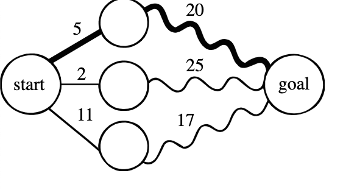

title:: algorithms/dynamic programming

- Dynamic programming is a thing
	- It is a thing that is real
		- Real is that thing
		- More things
	- More more things
- Let us tag this dynamic programming note with an [[example empty page link]]
- Let us also tag this dynamic programming note with an #example_tag
- Shortest optimal path substructure graphic:
	- 
	- The graphic is resized here:
		- {:height 214, :width 353}
-